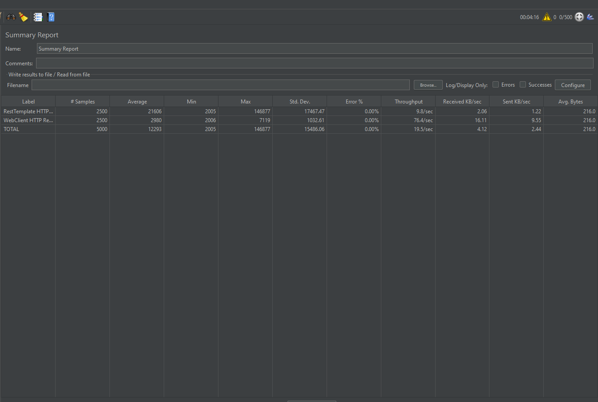

# Webclient

### WebClient란?

Spring Webflux에는 reactive, non-blocking하게 HTTP 요청을 처리할 수 있도록 WebClient라는 모듈을 제공한다. 기존의 RestTemplate과 같은 역할 하지만, non-blocking하다라는 점에서 차이가 있다.

내부적으로 WebClient는 HTTP 클라이언트 라이브러리에 위임하는데, 디폴트로 Reactor Netty의 HttpClient를 사용한다. Reactor Netty 외에도, Jetty의 HttpClient를 지원하며, 다른 라이브러리도 ClientHttpConnector에 넣어주면 사용할 수 있다.
</img>

```gradle
dependencies {
    compile 'org.springframework.boot:spring-boot-starter-webflux'
}
```

### Test

### vs RestTemplate

```console
PS C:\Users\11102>java -jar D:\03.작업공간\02.hiyoon\WebClientExample\build\libs\WebClientExample-0.0.1-SNAPSHOT.jar --server.port=8081
PS C:\Users\11102>java -jar D:\03.작업공간\02.hiyoon\WebClientExample\build\libs\WebClientExample-0.0.1-SNAPSHOT.jar --server.port=8082
PS C:\Users\11102>java -jar D:\03.작업공간\02.hiyoon\SimpleRestApi\build\libs\SimpleRestApi-0.0.1-SNAPSHOT.jar --server.port=9091
PS C:\Users\11102>java -jar D:\03.작업공간\02.hiyoon\SimpleRestApi\build\libs\SimpleRestApi-0.0.1-SNAPSHOT.jar --server.port=9092
PS C:\Users\11102>java -jar D:\03.작업공간\02.hiyoon\ActuatorMonitor\build\libs\ActuatorMonitor-0.0.1-SNAPSHOT.jar
```

* [http://localhost:8000/actuator](http://localhost:8000/actuator)





### Schedulers

Project Reactor의 핵심 패키지 중 하나인 reactor.core.scheduler에는 Schedulers 라는 추상 클래스가 존재한다.
이 Schedulers는 Scheduler 인터페이스의 팩토리 클래스이고, publishOn과 subscribeOn 을 위한 여러가지 팩토리 메서드를 제공한다.

팩토리 메서드는 대표적으로 아래와 같다.

* parallel():  ExecutorService기반으로 단일 스레드 고정 크기(Fixed) 스레드 풀을 사용하여 병렬 작업에 적합함.
* single(): Runnable을 사용하여 지연이 적은 일회성 작업에 최적화
* elastic(): 스레드 갯수는 무한정으로 증가할 수 있고 수행시간이 오래걸리는 블로킹 작업에 대한 대안으로 사용할 수 있게 최적화 되어있다.
* boundedElastic(): 스레드 갯수가 정해져있고 elastic과 동일하게 수행시간이 오래걸리는 블로킹 작업에 대한 대안으로 사용할 수 있게 최적화 되어있다.
* immediate(): 호출자의 스레드를 즉시 실행한다.
* fromExecutorService(ExecutorService) : 새로운 Excutors 인스턴스를 생성한다.

### Examples

1. 간단한 호출

WebClient의 GET 호출 예시입니다.

```java

public Mono<User> getUser(int id){
        LOG.info(String.format("Calling getUser(%d)",id));

        return webClient.get()
        .uri("/user/{id}",id)
        .retrieve()
        .bodyToMono(User.class);
}

```

2. 다른 서비스, 같은 타입

다른 서비스지만 반환 타입이 같은 경우에는 Flux.merge를 사용합니다.

```java

public Mono<User> getUser(int id){
        return webClient.get()
        .uri("/user/{id}",id)
        .retrieve()
        .bodyToMono(User.class);
}

public Mono<User> getOtherUser(int id){
        return webClient.get()
        .uri("/otheruser/{id}",id)
        .retrieve()
        .bodyToMono(User.class);
}

public Flux<User> fetchUserAndOtherUser(int id){
        return Flux.merge(getUser(id),getOtherUser(id))
        .parallel()
        .runOn(Schedulers.elastic())
        .ordered((u1,u2)->u2.id()-u1.id());
}
```

3. 다른 서비스, 다른 타입

별개의 End-Point이면서 반환 타입도 다른 경우에는 각각의 Mono를 셋팅하여 Mono.zip으로 처리합니다.

```java

public Mono fetchUserAndItem(int userId,int itemId){
        Mono<User> user=getUser(userId).subscribeOn(Schedulers.elastic());
        Mono<Item> item=getItem(itemId).subscribeOn(Schedulers.elastic());

        return Mono.zip(user,item,UserWithItem::new);
}
```

4. One More Thing...

동시호출과 순차호출이 Mix되어야하는 경우 Mono.then, Mono.zip으로 처리합니다.

### Test


### Additional Links

* [spring-5-webclient](https://www.baeldung.com/spring-5-webclient)
* [Spring WebClient 쉽게 이해하기](https://happycloud-lee.tistory.com/220)
* [Simultaneous Spring WebClient Calls](https://www.baeldung.com/spring-webclient-simultaneous-calls)
* [reactor.core.scheduler.Schedulers](https://projectreactor.io/docs/core/release/api/reactor/core/scheduler/Schedulers.html#elastic--)
* [Schedulers-정리](https://devsh.tistory.com/entry/Schedulers-정리)
* [Spring WebClient](https://dreamchaser3.tistory.com/11)

